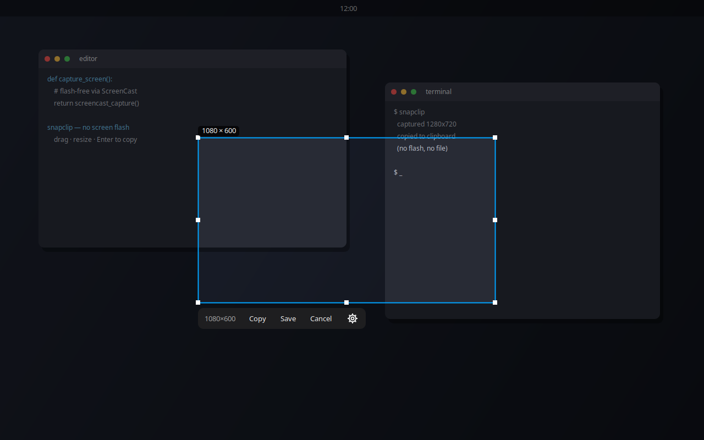

# snapclip — screenshots **without the screen flash** on Linux (Wayland / GNOME)

**snapclip is a minimal region-screenshot tool for Linux that does *not* flash the
screen when you take a screenshot.** Drag a see-through box over anything, press
**Enter** to copy it straight to the clipboard (or **S** to also save a PNG), and
the window closes. No flash, no shutter animation, no leftover files, and the
selection border is never in the shot.

Built for **Ubuntu / GNOME / Wayland**, where the usual screenshot tools either
don't work or trigger GNOME's annoying screen-flash effect.



---

## Why does taking a screenshot flash the screen on GNOME / Wayland?

If you searched for *"how to take a screenshot without the screen flashing on
Linux"*, *"disable GNOME screenshot flash"*, or *"Wayland screenshot no flash
animation"* — here's what's going on:

On **GNOME (Mutter) under Wayland**, the screenshot is taken by GNOME Shell
itself, through the **`org.gnome.Shell.Screenshot` D-Bus interface** or the **XDG
desktop `Screenshot` portal**. Every time that path captures the screen, GNOME
Shell plays a **white shutter-flash animation**. There is **no setting to turn
the screenshot flash off** — it's baked into the capture path that almost every
screenshot tool on GNOME Wayland uses (including the built-in `PrintScreen` UI and
portal-based tools like Flameshot on Wayland).

You also can't just switch tools: `grim`/`slurp`/`scrot` **don't work on GNOME**
(Mutter has no `wlr-screencopy`), and on modern GNOME `org.gnome.Shell.Screenshot`
returns `AccessDenied` to normal apps. So the only "supported" path is the portal
— and the portal flashes.

## How snapclip avoids the screenshot flash

snapclip captures the screen a different way: it grabs a **single frame from
Mutter's ScreenCast interface** (`org.gnome.Mutter.ScreenCast`) over **PipeWire**,
the same screen-recording machinery used for screen sharing. Screen recording does
**not** play the shutter flash and shows **no picker dialog** — so the capture is
completely silent and invisible.

That's the whole trick: **use screen-*cast* (recording), not screen-*shot*
(the flashing path).** snapclip grabs one frozen frame, lets you crop it, copies
the crop to the clipboard, and exits — with no flash at any point.

> Because *no flash* is the entire point, snapclip will **never** silently fall
> back to the flashing portal. If ScreenCast is unavailable it tells you what to
> install instead of flashing; you can pass `--allow-flash` to deliberately use
> the portal anyway.

---

## Features

- ✅ **No screen flash** — ever (Mutter ScreenCast + PipeWire capture).
- ✅ **Copy to clipboard** as `image/png` — paste into chat, a browser, GIMP, etc.
- ✅ **Copy never writes a file**; **Save** writes a timestamped PNG only when you ask.
- ✅ **See-through selection** — thin border + handles, the interior shows the real screen.
- ✅ Move / resize / rubber-band a new box; **double-click** to grab the whole monitor.
- ✅ **No capture flash, no toolbar clutter, no leftover temp files.**
- ✅ Correct under **fractional scaling** and **multi-monitor**.
- ✅ Settings (border, dim, save folder, …) + a hotkey-friendly single command.

---

## Install

Tested on **Ubuntu 26.04 / GNOME 50 / Wayland** (should work on any GNOME-Wayland
with `org.gnome.Mutter.ScreenCast`).

```bash
sudo apt install python3-gi python3-gi-cairo gir1.2-gtk-4.0 wl-clipboard \
    gir1.2-gstreamer-1.0 gir1.2-gst-plugins-base-1.0 \
    gstreamer1.0-pipewire gstreamer1.0-plugins-base -y

git clone https://github.com/gitoffmylibrary/snapclip.git
cd snapclip
./install.sh        # symlinks ~/.local/bin/snapclip + an apps-menu entry (no root)
```

`python3-gi-cairo` is required (GTK's Cairo drawing fails without it); the
GStreamer packages provide the flash-free capture. You can also run it in place
without installing: `python3 snapclip.py`.

---

## Usage

Run `snapclip` (after `install.sh`), from your apps menu, or via a hotkey.

| Action | Key | Button |
|---|---|---|
| Copy region to clipboard, then quit | **Enter** | **Copy** |
| Save timestamped PNG **and** copy, then quit | **S** | **Save** |
| Cancel — capture/save nothing, then quit | **Esc** | **Cancel** |
| Open settings | — | **⚙** |

- **Move:** drag inside the box.
- **Resize:** drag any edge or corner handle.
- **New selection:** drag on empty space to rubber-band a fresh box.
- **Double-click:** snap to the whole monitor; double-click again to restore.
- A live **W×H** readout (in real pixels) sits at the selection corner.

Copy puts the crop on the clipboard as `image/png` and **never writes a file**.
Save additionally writes `~/Pictures/Screenshots/snapclip-YYYY-MM-DD_HH-MM-SS.png`
(folder/format configurable).

### Bind it to a hotkey (recommended)

GNOME → **Settings → Keyboard → Keyboard Shortcuts → Custom Shortcuts → +**

- **Name:** snapclip
- **Command:** `snapclip` (after `./install.sh`) — or `python3 /full/path/to/snapclip.py`
  (only one overlay opens at a time — pressing the key again while it's open is a no-op)
- **Shortcut:** e.g. `Super+Shift+S` or `Ctrl+Alt+S`

To put it on **PrintScreen**, first clear GNOME's built-in binding at
*Settings → Keyboard → Screenshots*. Avoid plain app combos like `Ctrl+S`.

---

## Settings (the ⚙ button)

Stored in `~/.config/snapclip/config.json`:

| Setting | Default | Notes |
|---|---|---|
| Border colour | `#00A3FF` | Selection outline colour |
| Border width | `2` | px |
| Outside dim | `0.35` | Darkening **outside** the selection; interior is always see-through. `0` = none |
| Include mouse cursor | `off` | Best-effort: composites a pointer glyph inside the selection |
| Remember last selection | `on` | Reopen with the previous box |
| Save folder | `~/Pictures/Screenshots` | |
| Filename format | `snapclip-%Y-%m-%d_%H-%M-%S.png` | `strftime` pattern |

---

## How it works (and why, on Wayland)

1. **Capture once, up front, flash-free.** Before any window exists, snapclip
   grabs one frame of the primary monitor via Mutter ScreenCast + PipeWire into a
   Cairo surface (≈0.2 s, no flash, no file on disk). If ScreenCast is unavailable
   it refuses to capture (rather than silently flashing) unless you pass
   `--allow-flash`, which uses the portal and deletes its PNG dump.
2. **Frozen full-screen overlay.** That capture is shown frozen inside a single
   undecorated, full-screen GTK4 window. The selection rectangle is drawn *as
   graphics inside that fixed surface* — the window is never moved, which sidesteps
   Wayland's rule that an app may not set its own window position (the thing that
   breaks "draggable floating window" designs).
3. **Crop the pre-overlay capture.** Confirm crops the *cached* image, so the
   border/dim/toolbar can never appear in the result and there is no second capture.
4. **Clipboard with no temp file.** The crop is piped to `wl-copy --type image/png`
   over stdin; `wl-copy` daemonizes so the paste survives after snapclip exits.
5. **Scaling.** The crop scales the logical selection by `capture_px / logical_px`,
   so it stays correct under fractional display scaling.

## Testing

```bash
python3 test_snapclip.py               # core pipeline suite (capture, crop,
                                       # scaling, clipboard, save, config, geometry,
                                       # no-flash policy)
python3 snapclip.py --self-test copy   # exercise capture->crop->clipboard, no GUI
python3 snapclip.py --self-test save   # ...and the save path
```

Mouse-driven drag/resize can't be auto-tested (no input-injection tool works on
GNOME Wayland), so the move/resize **math** is unit-tested directly and the overlay
rendering is verified by screenshotting it.

---

## FAQ

### How do I take a screenshot on Linux without the screen flashing?
Use a tool that captures via **screen recording** (PipeWire / `ScreenCast`) instead
of the GNOME screenshot path. snapclip does exactly this. The GNOME screenshot UI
and portal-based tools flash because GNOME Shell plays a shutter animation on every
shot, and there is no option to disable it.

### Can I disable the GNOME screenshot flash with a setting?
No. GNOME does not expose a setting to turn off the screenshot flash — it's part of
the Shell's capture path. The only way to avoid it is to capture a different way
(which is what snapclip does).

### Why don't `grim`, `slurp`, or `scrot` work on my GNOME Wayland system?
`grim`/`slurp` rely on the `wlr-screencopy` protocol, which **wlroots** compositors
implement but **GNOME's Mutter does not**. `scrot` is X11-only. On GNOME Wayland the
supported capture paths are the GNOME Shell screenshot D-Bus interface (now
`AccessDenied` to normal apps), the XDG screenshot portal (which flashes), or — what
snapclip uses — Mutter ScreenCast over PipeWire (no flash).

### Does snapclip put the screenshot in the clipboard or save a file?
**Enter copies to the clipboard only** (`image/png`) and writes nothing to disk.
**S** copies *and* saves a timestamped PNG to `~/Pictures/Screenshots`. **Esc**
cancels with no capture and no clipboard change.

### Will the selection border show up in my screenshot?
No. snapclip crops a frame captured *before* the overlay appears, so the border,
dim, handles, and toolbar are never in the result.

### Does it work with fractional scaling and multiple monitors?
Yes. It captures the monitor the overlay opens on and scales the crop by
`capture_px / logical_px`, so the result matches your selection at any scale.

---

## Limitations

- The overlay opens on the **primary** monitor (ScreenCast grabs exactly that
  monitor, so the crop is offset-correct at any scale).
- "Include cursor" is best-effort (the capture excludes the real pointer).
- Requires `org.gnome.Mutter.ScreenCast` (GNOME Wayland). On stripped-down setups
  without it, pass `--allow-flash` to use the portal (which flashes).

## License

MIT — see [LICENSE](LICENSE).

---

*Keywords: Linux screenshot without flash · GNOME screenshot no flash · disable
screenshot flash Wayland · Wayland region screenshot to clipboard · screenshot tool
no shutter animation · Ubuntu GNOME screenshot flash fix.*
